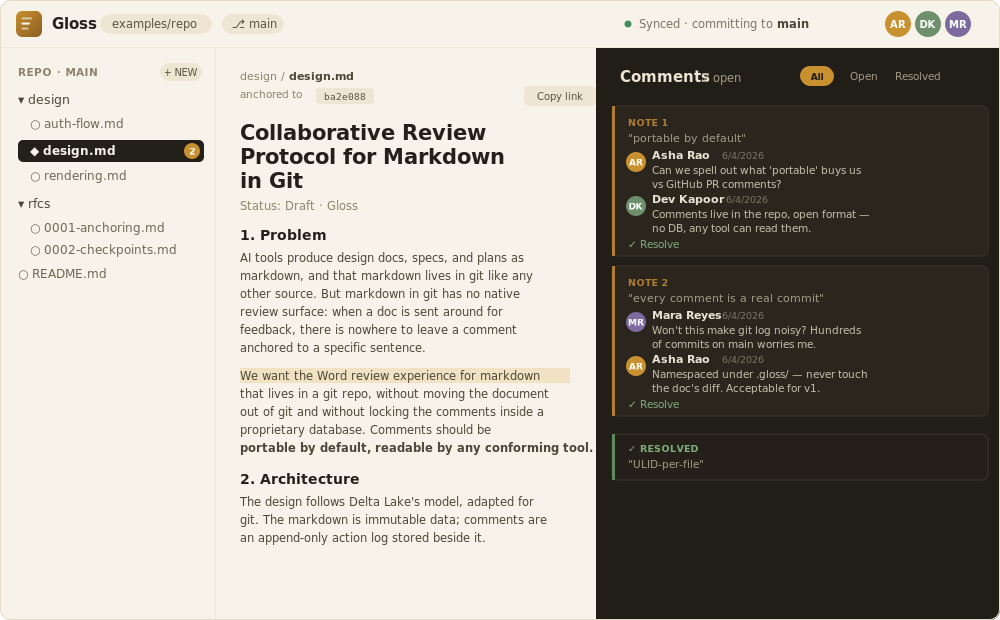

<p align="center">
  
</p>

<h1 align="center">Gloss</h1>

<p align="center">Word-style review comments for markdown that lives in git.</p>

<p align="center">
  <a href="https://github.com/satyahseelanne/glossmd/actions/workflows/ci.yml"></a>
  <a href="LICENSE"></a>
  = 20">
</p>

Comments are stored append-only in a `.gloss/` directory beside the document,
so review data is **portable by default** — no database, no central server
owning it, readable by any tool that implements the protocol.

A comment is a *gloss* on the text: an annotation in the margin.

<p align="center">
  
</p>

## Why

AI tools emit design docs as markdown into git, but markdown in git has no review
surface. Gloss adds select-to-comment threading — the experience of Word review —
without moving the document out of git and without locking comments in a vendor
database.

## How it works (one paragraph)

The markdown is immutable data; comments are an append-only action log beside it,
modelled on Delta Lake. Current review state is *derived by replaying the log*,
compacted periodically into checkpoints. Each action is one file named by a
**ULID**, so reviewers all commit to the same branch and never hit a merge
conflict — a colliding push just rebases and retries. Comments anchor to *rendered*
text via quote + context, re-located by fuzzy match on load.

See [`docs/protocol.md`](docs/protocol.md) for the full design and
[`docs/mockup.html`](docs/mockup.html) for the interactive UI mockup.

## Repository layout

```
gloss/
├── packages/
│   ├── core/      @gloss/core   — protocol logic: ULIDs, actions, reducer, checkpoints  ✅ tested
│   ├── anchor/    @gloss/anchor — capture + fuzzy re-locate text anchors                ✅ tested
│   ├── git/       @gloss/git    — host adapters + pull-rebase-push commit loop          ✅ tested
│   └── server/    @gloss/server — backend: GitHub OAuth, repo reads, commit actions     ✅ runs
├── apps/
│   └── web/       @gloss/web    — React reviewer app (WYSIWYG edit, tree, comments)      ✅ runs
├── infra/         Bicep for Azure Container Apps (deploy via azd)
├── examples/
│   └── repo/      a sample docs repo with a seeded .gloss/ log
└── docs/
    ├── protocol.md   full design doc
    └── mockup.html   interactive UI mockup
```

Status legend: ✅ implemented — core/anchor/git are unit-tested; server and web
run locally and deploy to Azure Container Apps.

## What runs today, with zero install

This repo's core logic has no third-party dependencies, so it runs on Node ≥ 20
straight away:

```bash
npm test            # ULID, reducer, checkpoint, anchor, and commit-loop tests
npm run demo        # a multi-reviewer session + compaction + stale-edit self-heal
npm run server:dev  # boots the backend on :8787 over an in-memory host (no token/network)
```

With the dev server running you can exercise the full surface:

```bash
curl 'http://localhost:8787/file?path=design/design.md'
curl -X POST localhost:8787/reviews/actions -H 'content-type: application/json' \
  -d '{"path":"design/design.md","action":{ ...a @gloss/core action... }}'
curl 'http://localhost:8787/reviews?path=design/design.md'
```

The web app (`apps/web`) is a working React reviewer — WYSIWYG markdown editing,
a file tree with document/folder create and delete, select-to-comment threading,
and shareable deep links. After `npm install`, run it against the dev server:

```bash
npm run server:dev              # backend on :8787 (in-memory host, no token)
cd apps/web && npm run dev      # Vite dev server, proxies the API to :8787
```

## Running against real GitHub

The server picks its mode at boot from the environment:

- **`--dev`** — in-memory host, no token or network. For local UI work.
- **Personal access token** (`GITHUB_TOKEN`) — single-user, reads/writes one repo.
- **OAuth** (`GLOSS_OAUTH_CLIENT_ID` / `GLOSS_OAUTH_CLIENT_SECRET`) — multi-user;
  each reviewer signs in with their own GitHub account.

Copy `.env.example` to `.env` and fill in the values for the mode you want. Never
commit `.env` (it is gitignored).

## Deploying

`infra/` holds Bicep that provisions Azure Container Apps (plus ACR and Log
Analytics). With the [Azure Developer CLI](https://aka.ms/azd):

```bash
azd up        # provision + build + deploy
azd deploy    # redeploy after code changes
```

The OAuth client secret is stored as a Container Apps secret and injected as an
environment variable — it is never baked into the image or committed to the repo.

## The two correctness guarantees, proven in tests

1. **Deterministic, order-independent reduction** — the same actions yield the
   same state regardless of the order git delivered the files.
2. **Checkpoint idempotence + late-arrival self-heal** — folding the log tail onto
   a checkpoint equals replaying from zero, and a stale action merging in after a
   checkpoint cannot clobber a newer value. (`packages/core/test/reducer.test.js`)

Plus, at the git layer: **no lost update under concurrent commits to one branch**
(`packages/git/test/commit.test.js`).

## Roadmap

- Per-branch write serialization in `@gloss/server` (queue concurrent commits to
  one head) and durable, shared sessions to scale past a single replica.
- Flesh out `@gloss/web` toward the mockup's fidelity; add real-time refresh.
- A `@gloss/vscode` extension implementing the same protocol against local git —
  no backend needed, fully interoperable with the web app's `.gloss/` logs.
- A background compaction job + checkpoint GC.
